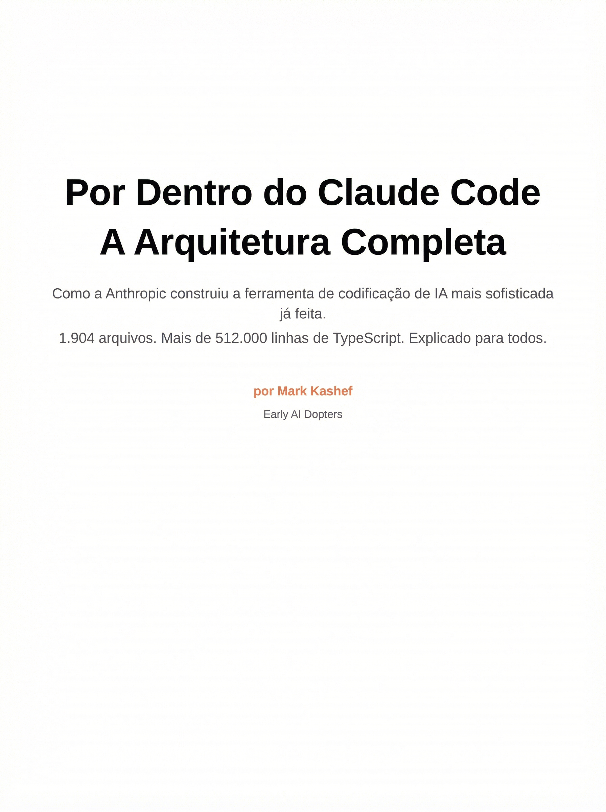
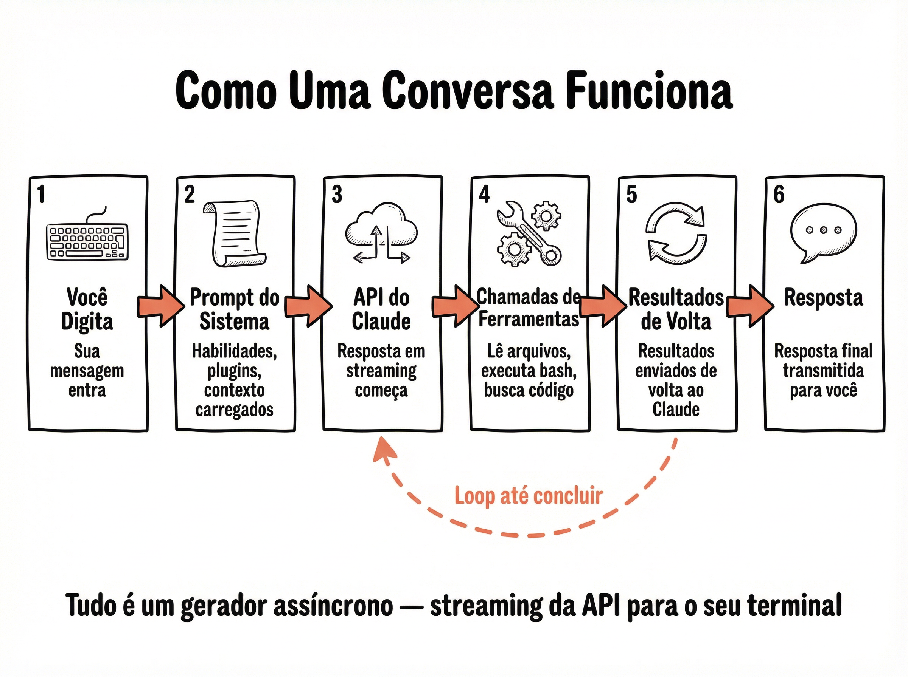
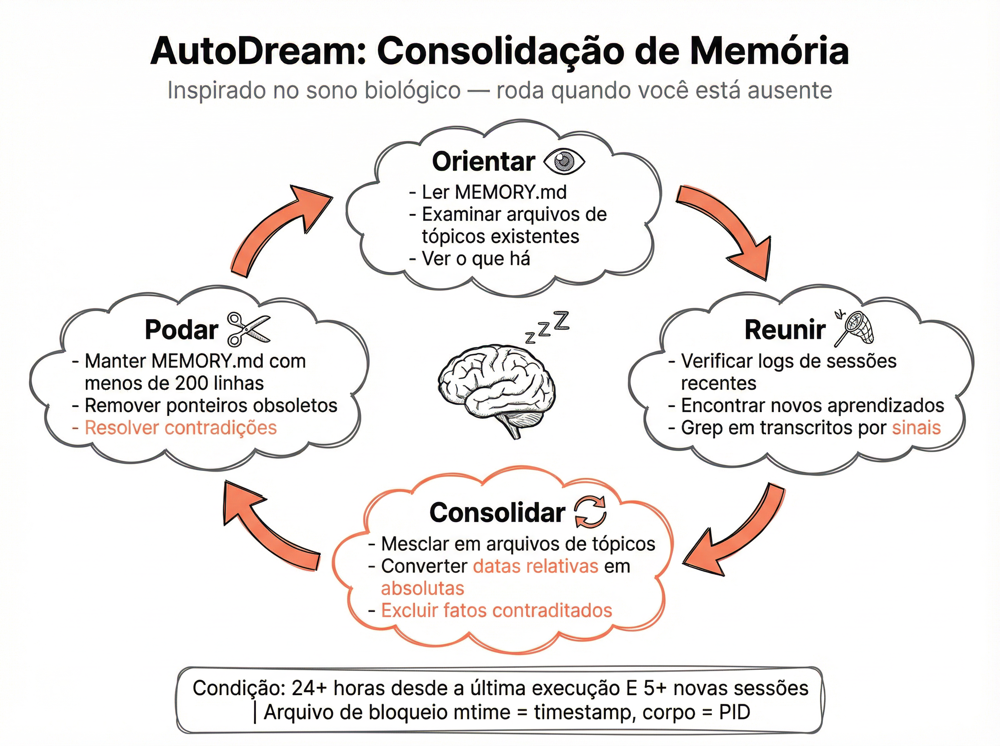

# Por Dentro do Claude Code: A Arquitetura Completa

Como a Anthropic construiu a ferramenta de codificação de IA mais sofisticada já feita.
**1.904 arquivos. Mais de 512.000 linhas de TypeScript. Explicado para todos.**
*por Mark Kashef — Early AI Dopters*

---

---

## O Que Tem Dentro

| # | Capítulo | Descrição |
|---|----------|-----------|
| 01 | **Conheça a Fera** | A visão geral do que o Claude Code realmente é |
| 02 | **Sob o Capô** | Como uma conversa flui do pressionar de tecla até a resposta |
| 03 | **A Caixa de Ferramentas** | Mais de 40 ferramentas e o modelo universal por trás de cada uma |
| 04 | **Clonando a Si Mesmo** | Como o Claude Code gera agentes e compartilha o cache da API |
| 05 | **Como Ele se Mantém Seguro** | Cinco paredes de segurança protegendo seu código |
| 06 | **O Aperto** | Encaixando conversas massivas na janela de contexto |
| 07 | **Nunca Esquece** | Quatro tipos de memória e sonhando enquanto você dorme |
| 08 | **Modo Exército** | Equipes de múltiplos agentes e planejamento baseado na nuvem |
| 09 | **Controle de Qualquer Lugar** | A ponte conectando o terminal ao navegador e IDE |
| 10 | **As Coisas Secretas** | Inteligência em segundo plano e um animal de estimação virtual |
| — | **Referência Rápida** | A folha de dicas da arquitetura |

---

## 01. Conheça a Fera

Antes de entrarmos nos detalhes, vamos ver o sistema inteiro de cima.

O Claude Code é a CLI oficial da Anthropic para trabalhar com o Claude a partir do seu terminal. Mas chamá-lo de CLI o subestima muito. É um **sistema operacional completo para desenvolvimento assistido por IA**, com 1.904 arquivos de código-fonte e mais de meio milhão de linhas de TypeScript.

Ele é construído com **Bun** (um runtime JavaScript rápido), **React e Ink** (para a interface de usuário do terminal) e **TypeScript**. Oito subsistemas principais irradiam do núcleo.

**Os oito subsistemas em resumo:**

| Subsistema | Função |
|---|---|
| **Motor de Consulta** | Fala com a API do Claude e gerencia o ciclo de vida da conversa |
| **40+ Ferramentas** | Lidam com leitura de arquivos, escrita, comandos shell, busca de código e mais |
| **Agentes** | Permitem que o Claude Code gere cópias de si mesmo para trabalhar em paralelo |
| **Ponte** | Conecta seu terminal a um navegador ou IDE para controle remoto |
| **Memória** | Lembra coisas sobre você e seus projetos entre as sessões |
| **Segurança** | Possui mais de 23 verificações de segurança para proteger seu sistema |
| **Gerenciador de Contexto** | Comprime conversas para que caibam na janela de contexto |
| **Habilidades e Plugins** | Tornam o sistema extensível com comandos personalizados |

> **Por Que Isso Importa**
> Isso não é um simples wrapper de chatbot. É um ambiente de desenvolvimento profundamente integrado que pode ler seu código, executar comandos, gerar subagentes, lembrar suas preferências e se conectar a ferramentas externas. Entender a arquitetura ajuda você a usá-lo melhor.

---

## 02. Sob o Capô

O que realmente acontece entre você pressionar Enter e ver uma resposta.

Cada conversa no Claude Code é gerenciada pelo **Motor de Consulta** (Query Engine). Uma instância por conversa. Quando você digita algo, isso inicia um fluxo de seis etapas que se repete até que o Claude termine.

**As seis etapas:**

1. **Você Digita:** sua mensagem entra no sistema.
2. **Prompt do Sistema:** carrega suas habilidades, plugins e contexto do projeto.
3. **API do Claude:** a solicitação é transmitida em streaming para os servidores da Anthropic.
4. **Chamadas de Ferramentas:** se o Claude precisar ler um arquivo ou executar um comando, ele chama uma ferramenta.
5. **Resultados de Volta:** os resultados da ferramenta voltam para o Claude para outra passagem.
6. **Resposta:** a resposta final é transmitida para o seu terminal.

As etapas 3 a 5 se repetem em um loop. O Claude pode ler um arquivo, depois executar um comando, depois ler outro arquivo e, finalmente, responder. Esse loop é o coração do sistema.

O loop de consulta é executado dentro de um loop `while(true)` infinito. Em seu centro está o **Streaming Tool Executor** (Executor de Ferramentas em Streaming), que executa ferramentas seguras para concorrência em paralelo e dá acesso exclusivo a ferramentas arriscadas. Se um modelo falhar, ele muda automaticamente para um modelo de fallback sem que você perceba. Se o contexto ficar muito grande, ele comprime em tempo real.

> **Insight Chave**
> Tudo no Claude Code é construído em **geradores assíncronos** (async generators). Isso significa que as respostas são transmitidas para o seu terminal em tempo real, ferramenta por ferramenta, palavra por palavra. Não é uma solicitação e resposta em lote. É um fluxo contínuo.

---

## 03. A Caixa de Ferramentas

Toda ferramenta segue o mesmo modelo. Entender uma significa entender todas elas.

O Claude Code tem mais de 40 ferramentas, e cada uma delas segue o mesmo padrão universal. Esta é uma das decisões de design mais limpas na base de código. Uma ferramenta é um objeto com cerca de 30 métodos que definem o que ela faz, como validar suas entradas, quem pode executá-la e o que acontece se você a interromper.

**O que toda ferramenta tem:**

| Método | Descrição |
|---|---|
| `call()` | Executa a ação (ler um arquivo, executar um comando, etc.) |
| `inputSchema` | Valida as entradas usando Zod antes da execução |
| `checkPermissions()` | Decide: permitir automaticamente, negar ou perguntar ao usuário |
| `isConcurrencySafe()` | Esta ferramenta pode ser executada em paralelo com outras? |
| `isReadOnly()` | Se verdadeiro, é seguro aprovar automaticamente |
| `interruptBehavior` | O que acontece se você pressionar Ctrl+C no meio da execução |
| `shouldDefer` | Carrega sob demanda via ToolSearch para manter a lista de ferramentas enxuta |

> **A BashTool**
> A ferramenta mais protegida em termos de segurança. Ela possui mais de 23 verificações de segurança que bloqueiam substituição de comando, comandos Zsh perigosos, flags ofuscadas, injeção de IFS, truques de espaço em branco Unicode e caracteres de controle. Comandos compostos como `cmd1 && cmd2` são divididos e cada parte é verificada independentemente.

---

## 04. Clonando a Si Mesmo

O Claude Code pode gerar cópias de si mesmo. Três maneiras diferentes, cada uma com diferentes compensações.

Um dos recursos mais poderosos é a capacidade de gerar **subagentes**. Estas são instâncias independentes do Claude que podem trabalhar em tarefas em paralelo. Existem três modos, cada um projetado para diferentes situações.

| Modo | Descrição | Melhor Para |
|---|---|---|
| **Padrão** | Inicia um agente novo com zero contexto. Você escreve o prompt completo e ele roda independentemente. | Pesquisa, exploração e verificação |
| **Fork** | O filho herda todo o contexto de conversa do pai. Prefixo idêntico em bytes = cache compartilhado. | Perguntas paralelas, pesquisa paralela |
| **Colega de Equipe** | Inicia um processo Claude Code separado em seu próprio painel de terminal (tmux ou iTerm2). | Enxames multi-agente |

> **O Truque do Cache de Prompt**
> Este é o molho secreto. Quando o pai bifurca três filhos, cada filho recebe **bytes idênticos** como prefixo. Os resultados das ferramentas recebem placeholders idênticos. Apenas o bloco de texto final difere por filho. O mesmo prefixo significa **um acerto de cache para todos os filhos**. Sem isso, três agentes custam 3x. Com isso, eles custam aproximadamente 1x.

---

## 05. Como Ele se Mantém Seguro

Cinco paredes concêntricas de segurança, da sandbox externa ao seu código protegido.

O Claude Code executa comandos shell, edita seus arquivos e acessa a internet. Esse nível de poder requer medidas de segurança sérias. O sistema de segurança é construído como **cinco paredes concêntricas**, como uma fortaleza.

**As cinco paredes de fora para dentro:**

| Camada | Proteção |
|---|---|
| **Sandbox** | Comandos rodam em sandbox por padrão, limitando o que podem acessar |
| **Sistema de Permissões** | Toda ferramenta tem regras de permitir, negar e perguntar |
| **Guardas da BashTool** | Mais de 23 verificações de segurança capturam padrões perigosos |
| **Análise de Comando** | Comandos compostos são divididos e cada subcomando é verificado |
| **Seu Código** | A fortaleza interna protegida |

A BashTool bloqueia especificamente: substituição de comando (`$()` e crases), comandos Zsh perigosos (`zmodload`, `sysopen`, `syswrite`), flags ofuscadas, injeção de IFS, truques de espaço em branco Unicode e caracteres de controle. Existe até um **classificador de ML** opcional que pode aprovar ou negar comandos automaticamente com base na compreensão semântica.

> **Proteção de Caminho UNC**
> No Windows, a FileEditTool bloqueia caminhos UNC (`\\servidor\compartilhamento`) para evitar vazamentos de credenciais NTLM. O sistema também bloqueia credenciais em URLs e verifica domínios contra a API de lista de bloqueio da Anthropic antes de buscar qualquer conteúdo da web.

---

## 06. O Aperto

Como o Claude Code encaixa conversas massivas em uma janela de contexto finita.

Todo modelo de IA tem uma **janela de contexto**, um limite de quanto texto ele pode processar de uma vez. Longas sessões de codificação geram enormes quantidades de contexto: leituras de arquivos, saídas de comandos, resultados de pesquisa, histórico de conversas. O pipeline de compactação gerencia isso.

**Quatro estágios, cada um progressivamente mais agressivo:**

| Estágio | Ação |
|---|---|
| **Microcompactar** | Remove resultados de ferramentas antigas. O fato de você ter lido o arquivo permanece, mas a saída é removida. |
| **Corte de Histórico** | Apara rodadas de conversas antigas. As trocas recentes ficam, as antigas vão. |
| **Autocompactar** | Acionado quando o contexto atinge um limite. Gera um subagente que lê o histórico completo e produz um resumo compactado. |
| **Memória da Sessão Sobrevive** | Fatos chave são reinjetados após a compressão, para que o contexto crítico nunca seja perdido. |

> **Microcompactação em Cache**
> Existe uma variante especial chamada **microcompactação em cache** que usa uma API de edição de cache para remover resultados de ferramentas sem quebrar o cache do prompt. Isso significa que a compressão não desperdiça o prefixo em cache, economizando dinheiro em cada chamada de API subsequente.

---

## 07. Nunca Esquece

Quatro tipos de memória, mais um sistema de sono biológico que as consolida.

O Claude Code tem um sistema de memória sofisticado que lembra coisas sobre você e seus projetos entre as sessões. Não é apenas um arquivo simples. Existem **quatro tipos distintos de memória**, cada um servindo a um propósito diferente.

**Os quatro tipos:**

| Tipo | Conteúdo |
|---|---|
| **Memória do Usuário** | Quem você é, seu papel, preferências, nível de especialização. Como o Claude adapta as respostas para você. |
| **Memória de Feedback** | O que você corrigiu e o que funcionou. Tanto erros quanto vitórias. Evita que o Claude repita o mesmo erro. |
| **Memória do Projeto** | Contexto de trabalho ativo, objetivos, prazos, decisões. Datas relativas são convertidas em absolutas. |
| **Memória de Referência** | Ponteiros para sistemas externos: onde os bugs são rastreados, qual painel do Grafana verificar, qual projeto do Linear olhar. |

Cada memória é armazenada como seu próprio arquivo markdown com frontmatter YAML. `MEMORY.md` é um índice de 200 linhas que aponta para tudo. O **Team Memory Sync** pode compartilhar memórias entre colegas de equipe, com um scanner de segredos que pré-filtra os arquivos antes do upload.

O **AutoDream** tem o nome do sono biológico, onde memórias de curto prazo se consolidam em armazenamento de longo prazo. Ele é executado automaticamente quando duas condições são atendidas: **mais de 24 horas** desde a última execução E **mais de 5 novas sessões** acumuladas.

**Quatro fases:**

1. **Orientar:** lê o diretório de memória e examina os arquivos de tópicos existentes.
2. **Reunir:** verifica os logs de sessões recentes e usa grep nas transcrições em busca de novos sinais.
3. **Consolidar:** mescla novas informações em arquivos de tópicos, converte datas relativas em absolutas, exclui fatos contraditórios.
4. **Podar:** mantém o índice com menos de 200 linhas, remove ponteiros obsoletos.

> **Arquivo de Bloqueio como Máquina de Estado**
> O AutoDream usa um arquivo de bloqueio (lock file) onde o **tempo de modificação É o carimbo de data/hora**, e o corpo do arquivo contém o ID do processo. Um único arquivo que serve tanto como bloqueio quanto como máquina de estado. Elegantemente simples.

---

## 08. Modo Exército

Quando um agente não é suficiente, o Claude Code implanta um exército.

Para tarefas complexas que se beneficiam do trabalho paralelo, o Claude Code pode implantar vários agentes como uma equipe coordenada. Um **Líder de Equipe** orquestra os trabalhadores, cada um executando em seu próprio painel de terminal.

O Líder de Equipe coordena a missão, roteia permissões e envia tarefas por meio de um sistema de caixa de correio. Os trabalhadores se especializam: um pode pesquisar, outro escreve código, um terceiro executa testes e revisões. Eles se comunicam por meio de mensagens de caixa de correio e podem solicitar permissões ao líder.

**Dois backends de execução:**

| Backend | Descrição |
|---|---|
| **Painéis tmux/iTerm2** | Cada trabalhador roda como um processo separado do Claude Code em seu próprio painel de terminal. Isolamento total, poder total. |
| **No processo** | Os trabalhadores rodam como agentes bifurcados dentro do mesmo processo. Mais leve, usa `AsyncLocalStorage` para isolamento de contexto. |

O **Ultraplan** leva isso adiante teletransportando o trabalho para uma sessão remota na nuvem. Você digita `ultraplan` e seu prompt é enviado para a infraestrutura de nuvem da Anthropic. Um agente remoto projeta o plano de implementação completo. Você o revisa e aprova em seu navegador. Em seguida, ele se teletransporta de volta para o seu terminal para execução local.

> **Pacotes Git (Git Bundles)**
> Ao teletransportar para a nuvem, o Claude Code cria um **pacote git** para semear o ambiente remoto com seu repositório. Fallback de três camadas: histórico completo, depois apenas HEAD, depois um único commit mesclado (squashed). Ele até captura trabalhos não confirmados via `git stash`.

---

## 09. Controle de Qualquer Lugar

A ponte que conecta seu terminal ao navegador, IDE ou qualquer outro lugar.

A **Ponte** (Bridge) é o que permite que você controle o Claude Code a partir do claude.ai em seu navegador, VS Code ou JetBrains. Ela cria uma conexão bidirecional entre seu terminal local e uma interface remota.

Os dados fluem em ambas as direções. Resultados de ferramentas e respostas vão do seu terminal para o navegador. Mensagens do usuário e decisões de permissão voltam do navegador para o seu terminal. A ponte lida com autenticação JWT com atualização de token programada, WebSocket para leituras, HTTP POST para gravações e tempos limite de sessão de 24 horas.

**Duas versões da ponte:**

| Versão | Descrição |
|---|---|
| **V1 (API de Ambiente)** | Registra um ambiente, pesquisa por trabalho, gera sessões e retransmite mensagens. A abordagem original. |
| **V2 (Sessão Direta)** | Cria uma sessão diretamente, usa transporte SSE e aumenta as épocas. A abordagem mais nova e simples. |

> **Suporte a Múltiplas Sessões**
> A ponte pode lidar com várias sessões simultâneas. Cada sessão pode ser executada em sua própria árvore de trabalho git (git worktree) para isolamento total, ou compartilhar o mesmo diretório. A capacidade da sessão é gerenciada com verificações de integridade de pulsação (heartbeat) e cães de guarda (watchdogs) de tempo limite.

---

## 10. As Coisas Secretas

Recursos executados em segundo plano que a maioria das pessoas nunca vê.

O Claude Code executa vários sistemas inteligentes silenciosamente em segundo plano, todos usando o **padrão de agente bifurcado** para compartilhar o cache de prompt do pai. Isso significa que eles não custam quase nada em chamadas de API extras.

**Os cinco sistemas em segundo plano:**

| Sistema | Função |
|---|---|
| **Sugestões de Prompt** | Prevê o que você digitará a seguir (2-12 palavras) e mostra como texto fantasma. Pode acionar execução especulativa. |
| **Extração de Memória** | Após cada consulta, um agente em segundo plano escreve memórias duráveis da conversa. Pula se você já escreveu na memória. |
| **MagicDocs** | Qualquer arquivo markdown com cabeçalho `# MAGIC DOC` é atualizado automaticamente com novos aprendizados após cada turno de conversa. Documentação viva. |
| **Resumo do Agente** | Para subagentes, produz atualizações de status de 3-5 palavras a cada 30 segundos para a exibição de progresso. |
| **Memória da Sessão** | Mantém um arquivo markdown por sessão que sobrevive à compressão de contexto. |

**The Buddy System (O Sistema de Companheiros)** é o recurso mais surpreendente. Um companheiro de estimação virtual completo com lançamento em abril de 2026. Seu companheiro é gerado deterministicamente a partir do seu ID de usuário usando um gerador de números aleatórios com semente. Você sempre recebe o mesmo animal de estimação. **Você não pode rolar novamente.**

**As estatísticas:**

| Atributo | Detalhes |
|---|---|
| **18 espécies** | Pato, ganso, bolha, gato, dragão, polvo, coruja, pinguim, tartaruga, caracol, fantasma, axolote, capivara, cacto, robô, coelho, cogumelo, chonk |
| **5 raridades** | Comum (60%), Incomum (25%), Raro (10%), Épico (4%), Lendário (1%) |
| **5 stats de RPG** | Depuração, Paciência, Caos, Sabedoria, Sarcasmo |
| **Extras** | 1% de chance brilhante, 8 tipos de chapéu, 6 estilos de olhos |
| **Animações** | 3 quadros ASCII, balões de fala, corações flutuantes ao fazer carinho |

---

## Referência Rápida

| Tópico | Resumo |
|---|---|
| **Números Principais** | 1.904 arquivos, 512.000+ linhas, TypeScript + Bun + React/Ink |
| **Motor de Consulta** | Gerador assíncrono, uma instância por conversa, loop de ferramentas |
| **Modelo de Ferramenta** | `call()`, `inputSchema`, `checkPermissions()`, `isConcurrencySafe()` |
| **Geração de Agentes** | Padrão, Fork (cache compartilhado), Colega de Equipe |
| **Segurança** | Sandbox, Permissões, BashTool Guards, Análise de Comando, Código Protegido |
| **Compactação** | Microcompactar → Corte de Histórico → Autocompactar → Memória da Sessão |
| **Memória** | Usuário, Feedback, Projeto, Referência — índice MEMORY.md de 200 linhas |
| **Multi-Agente** | Líder + Trabalhadores via tmux/iTerm2 ou agentes bifurcados no processo |
| **A Ponte** | V1: API de Ambiente | V2: Sessão Direta + SSE | Autenticação JWT |
| **Segundo Plano** | Sugestões, Extração de Memória, MagicDocs, Resumo, Memória da Sessão |
| **O Companheiro** | Determinístico por hash(userId), 18 espécies, 5 raridades, 1% brilhante |
| **Feature Flags** | `PROACTIVE`, `KAIROS`, `BRIDGE_MODE`, `BUDDY`, `VOICE_MODE`, `FORK_SUBAGENT` |

---

**Early AI Dopters**
[https://www.skool.com/earlyaidopters/about](https://www.skool.com/earlyaidopters/about)
Junte-se à comunidade para mais guias, análises e ferramentas de IA.
